# Lab 1 - Deploy your first contract using VSCode 👩🏻‍💻 👨🏻‍💻

 - [STEP 1](#step-1): Create a Smart Contract
 - [STEP 2](#step-2): Set up the IBM Blockchain Platform environment
 - [STEP 3](#step-3): Test the smart contract
 - [NEXT STEPS](#next-steps)

This lab is a technical introduction to blockchain, specifically smart contract development using the latest developer enhancements in the Linux Foundation’s Hyperledger Fabric v1.4 and shows you how IBM’s Blockchain Platform’s developer experience can accelerate your pace of development.

This lab will take you through using the smart contract development environment in Visual Studio Code (VSCode). Although smart contracts can be developed in any editor, IBM Blockchain Platform provides a plugin for VSCode that greatly simplifies the steps required. In addition, it also provides a “sandbox” development environment for easy development and test purposes using a real Hyperledger Fabric runtime.

## Pre-requisites
 - Docker https://www.docker.com/get-started 
 - VSCode https://code.visualstudio.com/
 - IBM Blockchain Platform plugin https://marketplace.visualstudio.com/items?itemName=IBMBlockchain.ibm-blockchain-platform

## Step 1 
### Create a Smart Contract

Launch VSCode on your computer.
When VSCode opens, click on the IBM Blockchain Platform (IBP) icon in the Activity Bar in VSCode as shown below.

<br>
<p align="center">
  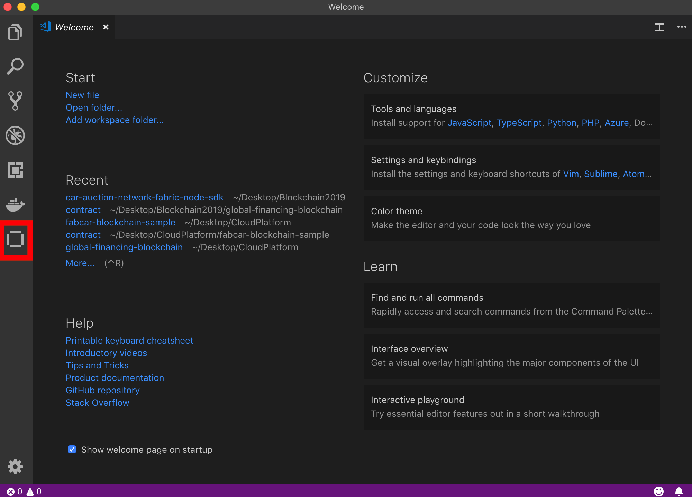
</p>
<br>

This will open the Homepage for IBM Blockchain Platform. As highlighted below, there will be a message in the bottom right telling you the extension has activated and other information telling you some of the capabilities of the plugin. These informational messages are used a lot in VSCode and will appear throughout this lab at various points.

<br>
<p align="center">
  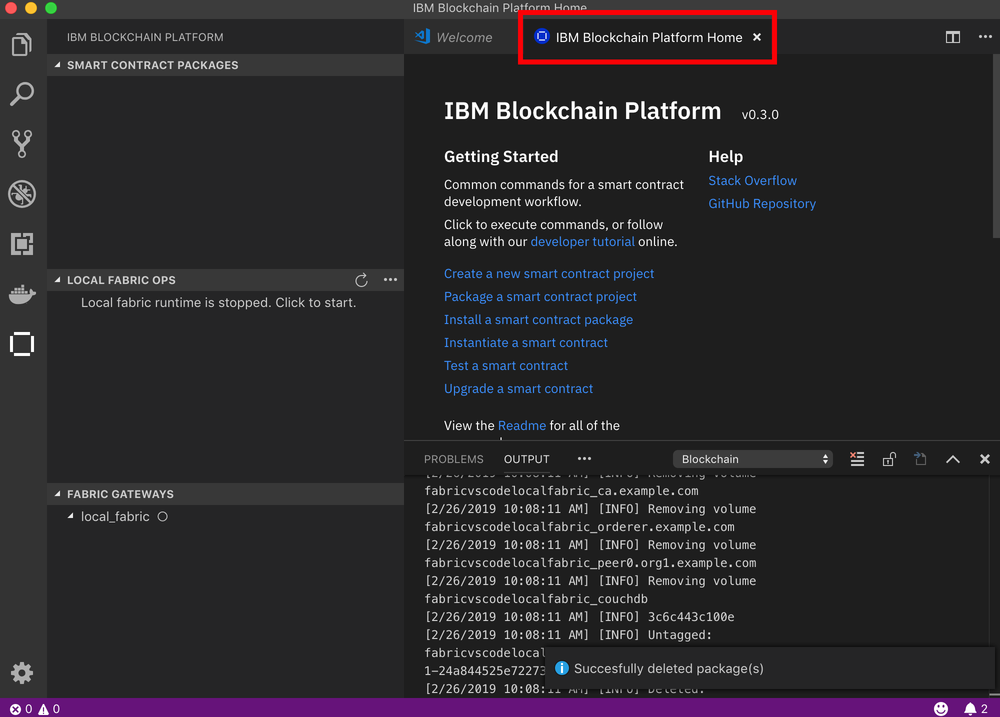
</p>
<br>

Once you have had a look at the Homepage, click on the “Create a new smart contract project” link toward the top of the Homepage.

<br>
<p align="center">
  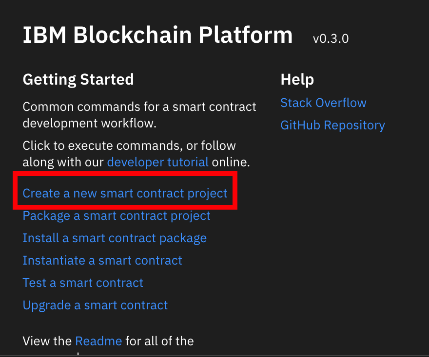
</p>
<br>

Notice a couple of informational messages will appear in the bottom right of the VSCode window. 

After a little delay, at the top of the screen, you will be presented with a choice of languages. For this lab we are going to use JavaScript, so click to choose the JavaScript option:

<br>
<p align="center">
  
</p>
<br>

In the dialogue that appears, create a new folder then click the create folder named "first-contract" and click create. Then click Open in the bottom right. 

<br>
<p align="center">
  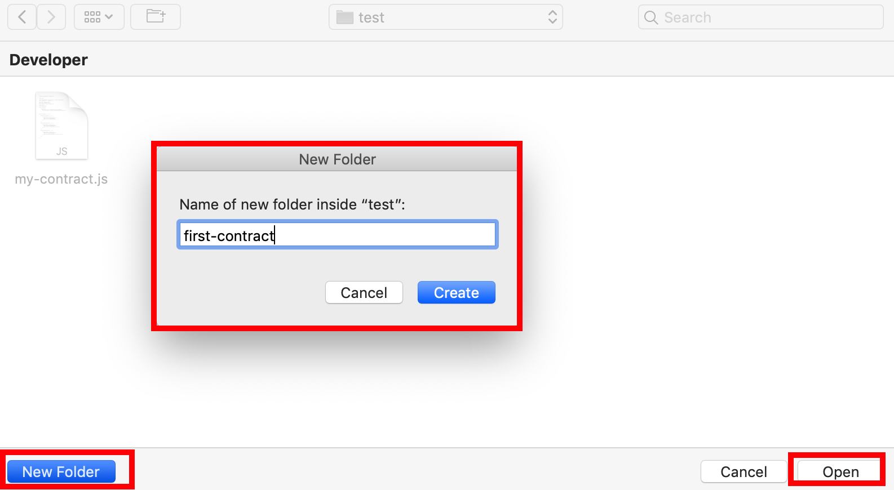
</p>
<br>

Next, select the “Add to workspace” option that appears at the top of the VSCode window.

<br>
<p align="center">
  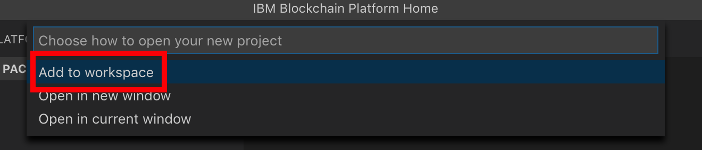
</p>
<br>

Wait for the information messages to appear whilst the project is generated as this can take up to a minute or more to complete.

You may notice that another copy of the IBP Homepage opens at this point. This can safely be closed by clicking on the “x” on the window.

<br>
<p align="center">
  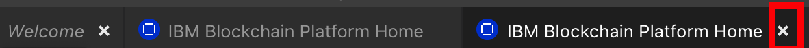
</p>
<br>

We can now switch to the Explorer view briefly to see the files generated by the plugin for the new smart contract. To do this choose the top left folder shaped icon in the activity bar (  ).

Click to expand the lib folder and open the my-contract.js file by double clicking on it. This is the main file for the contract.

<br>
<p align="center">
  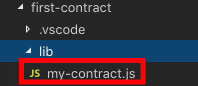>
</p>
<br>

When the my-contract.js file is open, you should see it in the main window to the right.

Take a look at the contents of this file. As you can see, the main body of the code is on lines 7 – 23. These define a very simple smart contract that does not make any updates to the ledger, it only echos a string when a transaction function is called.

A more detailed overview of the code is as follows:

<br>
<p align="center">
  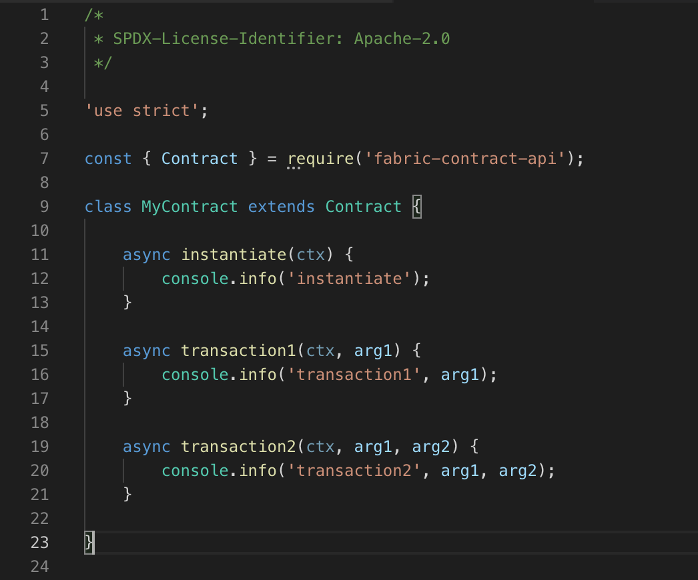>
</p>
<br>

- **Line 7** imports a Contract definition from the fabric-contract-api node module. This makes the Fabric API available to the smart contract to use.

- **Line 9** starts the definition of a class called MyContract that extends the Contract we imported above. This provides our class with several capabilities such as defining our class to be a contract that can be called by the framework and giving us access to transaction handlers and a transaction based context called ctx. The context allows the framework to pass extra information into the transaction function when it is called. For example it can pass information about the identity of the caller of the contract as well as methods to query the world-state when the transaction is called.

- **Line 11** shows the definition of an instantiate method which can be used to initialise the contract when it is first deloyed or after an upgrade. By default this method takes a single context argument called ctx which is a context as described above. If required, it could take extra parameters as well.

- **Line 15** defines a transaction function called “transaction1”. All transaction functions must take a context as their first parameter, usually called “ctx”. This is normally followed by one or more arguments that are passed to the transaction from the client.

- **Line 19** defines a second transaction function called “transaction2” which this time takes two parameters after the context.

Next we will package the smart contract. Click on the IBM Blockchain Platform icon in the sidebar to switch back to the IBM Blockchain Platform view. 

<br>
<p align="center">

 </p>
<br>

From the Smart Contract Packages view click the “+” icon to package the smart contract into a deployment package. If you do not see the “+”, first click in the Smart Contract Packages view.

<br>
<p align="center">
  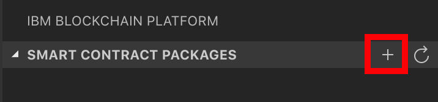
</p>
<br>

You will first see an informational message about packaging the contract, then you will see a package appear after it is created, called first-contract@0.0.1

<br>
<p align="center">
  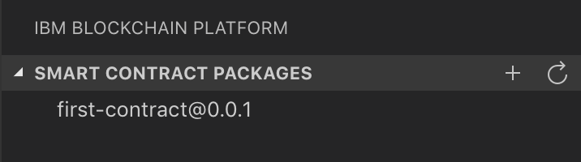
</p>
<br>

This package is now ready to be installed onto a blockchain peer. 

## Step 2
### Set up the IBM Blockchain Platform environment

Next we will create the IBM Blockchcain Platform local development environment in VSCode. In the Blockchain Connections view click on LOCAL FABRIC OPS.

<br>
<p align="center">
  
</p>
<br>

The circle icon next to local_fabric may appear to spin and text will appear in the output window to show progress. Note that this may take a little time to complete.

Once the text “[channelCmd] executeJoin -> INFO 002 Successfully submitted proposal to join channel” appears in the Output
window and the local_fabric circle icon is solid, click on local_fabric again to connect.
At this point there will be an information message confirming that the connection has been made.

When the connection is made, you should see a channel called mychannel appear, which you should click to expand. Underneath Nodes you will see a peer called peer0.org1.example.com .

<br>
<p align="center">
  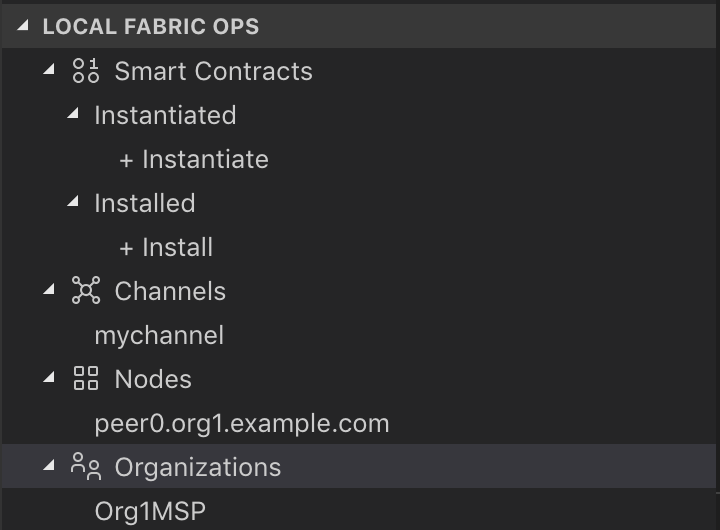
</p>
<br>

This is the simple single-channel, single-peer network that the plugin creates for test and development purposes.

Hyperledger Fabric requires that contracts are installed on a peer and then instantiated on a channel before use, so that’s what we will do next over the next few steps.

Right click on the peer peer0.org1.example.com and choose “Install Smart Contract” from the context menu

<br>
<p align="center">
  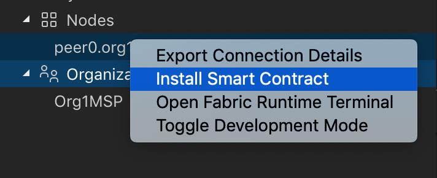
</p>
<br>

From the “Choose which package to install on the peer” pop up at the top of the screen, choose “first-contract@0.0.1 Packaged” from the options.

<br>
<p align="center">
  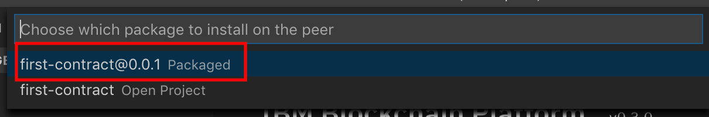
</p>
<br>

When the package is installed, an information message will be shown confirming the install.
Confirm that under "Installed" you can see your first-contract installed. 

Next we have to instantiate the contract. Right click on the “mychannel” in the LOCAL FABRIC OPS and choose “Instantiate Smart Contract” from the context menu:

<br>
<p align="center">
  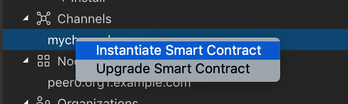
</p>
<br>

From the “Choose a smart contract and version to instantiate” pop up at the top of the screen, choose “first-contract@0.0.1 Installed” from the options:

<br>
<p align="center">
  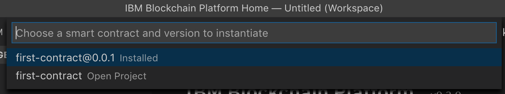
</p>
<br>

In the pop up dialogue box at the top of the screen asking **“optional: What function do you want to call? …”** make sure you enter the word **instantiate** into the entry field as shown below. 

<br>
<p align="center">
  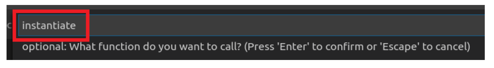
</p>
<br>

Before you press enter, check your spelling and make sure it is correct and is all lowercase without any quotes or spaces around it. This name has to exactly match the name of the transaction in your contract that will be called at instantiate time and in our default contract as we saw above this is called instantiate.

In the next dialogue that asks for parameters to the function, just press “Enter” as our instantiate function does not require any apart from the context “ctx” which is automatically provided by the framework.

Instantiating a contract can take several minutes as a new docker container is built to contain the contract. 
When it is complete you will see an information message.

## Step 3
### Test the smart contract

At this point the contract is now ready to be called. The instantiate transaction has already been run when the contract was instantiated by the framework. This transaction simply prints out the word “instantiate” to the console. 

Click on Test the smart contract. 

<br>
<p align="center">
  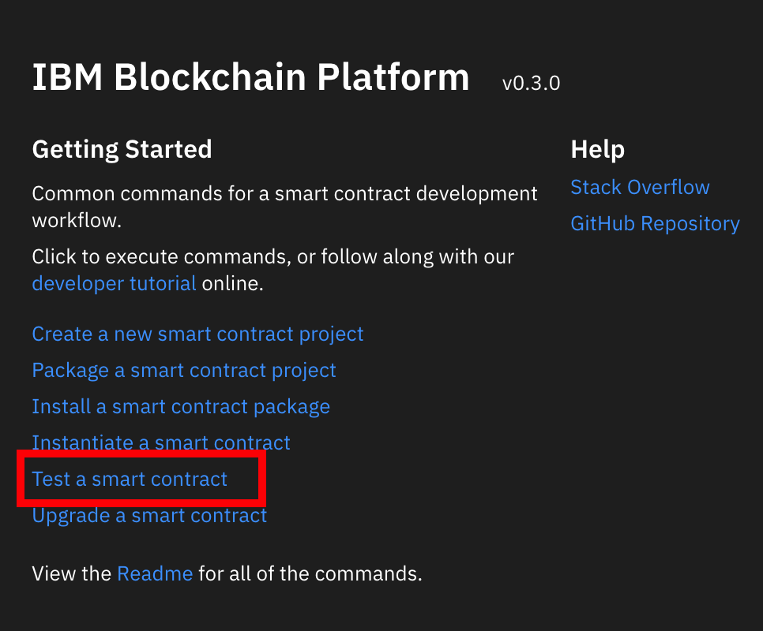
</p>
<br>

Then select the **local_fabric** and choose the smart contract to test, in this case the **first-contract@0.0.1**. Select **Javasctipt** as the programming language.

In the left side menu you will see the instantiated contract first-contract@0.0.1, and you will see the three transactions that were defined in the contract are now available.

<br>
<p align="center">
  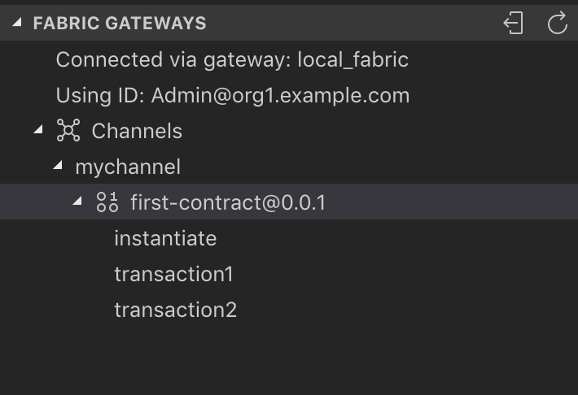
</p>
<br>

Because the contract is running inside a docker container, we need to look at the docker logs to see the output. To see the docker logs we need to get the name of the docker container that is running the contract. 

To do this we could list all the running containers with “docker ps” and look for the right one.

However as the names of the containers used by Fabric and the IBP plugin are deterministic, we can simple issue the command in the terminal window inside VSCode.

Switch to the terminal window at the bottom of the VSCode screen

<br>
<p align="center">
  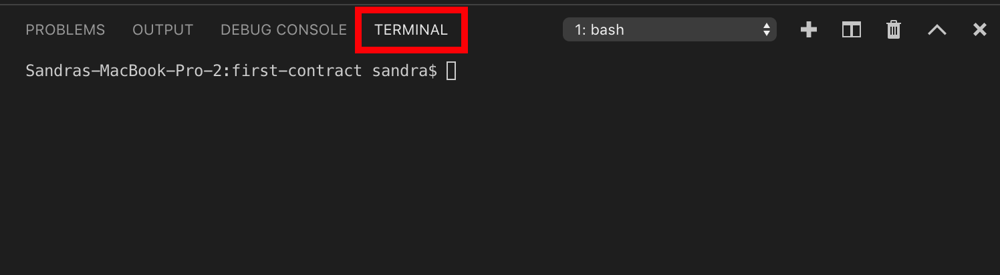
</p>
<br>

Note that if your window size is small, you might not be able to see the Terminal window and you must first click on the ellipsis (…) to allow you to view it.


At the prompt enter this command (you can copy and paste it if you wish): 

```
docker logs fabricvscodelocalfabric-peer0.org1.example.com-first-contract-0.0.1
```

This will produce several lines of output, most of which you can ignore and at the bottom of which will be the word “instantiate”.

<br>
<p align="center">
  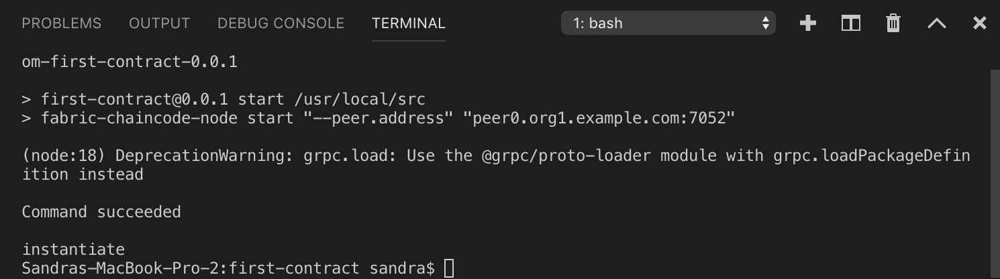
</p>
<br>

Now we will execute another transaction. From the “Blockchain Connections” view, expand out the instantiated contract as you did before until you can see the transactions, right click on “transaction1” and choose “submit transaction”:

<br>
<p align="center">
  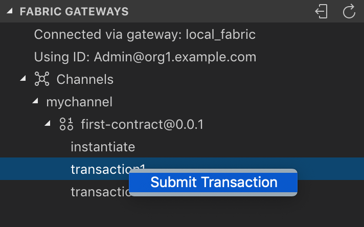
</p>
<br>

In the dialogue at the top of the screen enter the text “Hello World” or some similar text as shown below and press “Enter”. Note that you should not enter the quotes around the words as otherwise they will be taken as part of the string itself.

An information message will inform you when the transaction is complete.

To take a look at the output, switch back to the terminal view and press the “up arrow” key to choose the docker logs command again. If you have trouble you can just Re-enter it:

```
docker logs fabricvscodelocalfabric-peer0.org1.example.com-first-contract-0.0.1
```
You should now see the output contrains “transaction1” followed by the text you entered above.

<br>
<p align="center">
  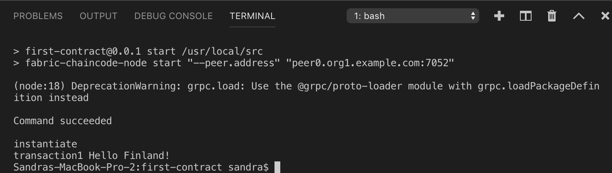
</p>
<br>

Finally let’s call the second transaction for completeness. Right click on transaction2 as you did above for the first transaction. 


This time the transaction takes two parameters, so we need to enter each one separated by a comma, such as
Hello,first-contract . Note that there should be no quotes or spaces around the parameters as shown below as otherwise they are taken as part of the parameters itself - they are not stripped off before the transaction is called. Press “Enter” when you are done.

<br>
<p align="center">
  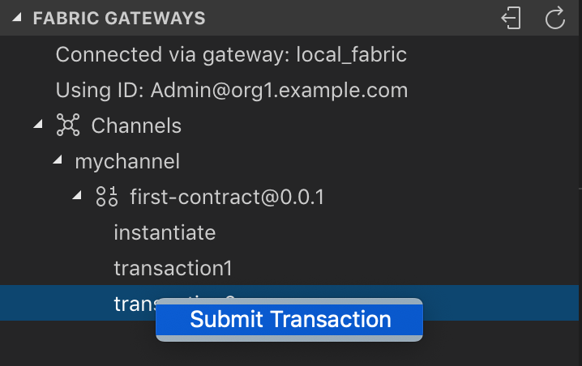
</p>
<br>

Again switch back to the terminal view as you did before and re-execute the docker logs command again to see the output from the second transaction call. You should see something like this below:

```
docker logs fabricvscodelocalfabric-peer0.org1.example.com-first-contract-0.0.1
```

<br>
<p align="center">
  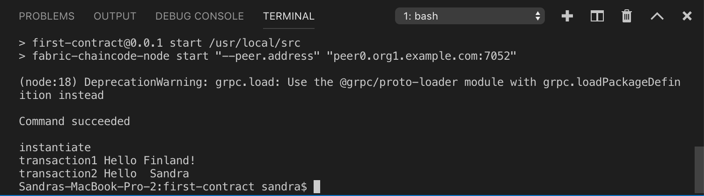
</p>
<br>


## Next Steps
In this lab you have experienced an overview of using the IBM Blockchain Platform development experience. In part two, we will take this further and show how to use a sample contract that comes with Hyperledger Fabric with VSCode and actually start updating a blockchain for real.


